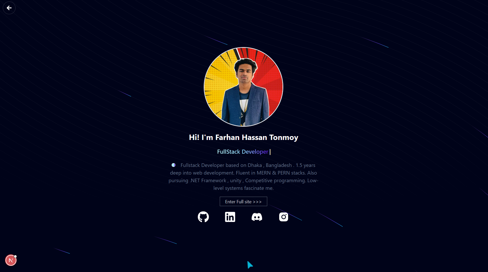

# TNMT Portfolio V2 (NEXT.js)



A modern, interactive portfolio website built with Next.js 15, featuring stunning animations and a sleek dark/light theme toggle. Showcasing projects, skills, and professional experience with smooth transitions and engaging UI components.

## ✨ Features

- **Modern Design**: Clean, professional layout with dark/light theme support
- **Smooth Animations**: Powered by Framer Motion for engaging user interactions
- **Responsive**: Fully responsive design that works on all devices
- **Interactive Components**: Dynamic typewriter effects, animated cards, and hover interactions
- **Tech Stack Icons**: Beautiful tech stack representations with animated icons
- **Fast Performance**: Built with Next.js 15 and Turbopack for optimal loading speeds
- **Accessibility**: Semantic HTML and keyboard navigation support

## 🛠️ Tech Stack

- **Framework**: Next.js 15 (with Turbopack)
- **Language**: TypeScript
- **Styling**: Tailwind CSS
- **Animations**: Framer Motion
- **Icons**: Lucide React, React Icons, Tabler Icons, Tech Stack Icons
- **UI Components**: Aceternity UI components
- **Theme**: Next Themes for dark/light mode
- **Code Highlighting**: React Syntax Highlighter

## 🚀 Getting Started

### Prerequisites

- Node.js 18+
- npm, yarn, or pnpm

### Installation

1. Clone the repository:

```bash
git clone <repository-url>
cd portfolio-nextjs
```

2. Install dependencies:

```bash
npm install
# or
yarn install
# or
pnpm install
```

3. Run the development server:

```bash
npm run dev
# or
yarn dev
# or
pnpm dev
```

4. Open [http://localhost:3000](http://localhost:3000) in your browser.

## 📁 Project Structure

```
├── app/                    # App router pages
│   ├── about/             # About page
│   ├── blogs/             # Blog section
│   ├── edu/               # Education page
│   ├── home/              # Home page components
│   ├── introAnimated/     # Animated intro section
│   ├── Misc/              # Miscellaneous components
│   ├── notfound/          # 404 page
│   ├── outro/             # Outro/contact section
│   ├── projects/          # Projects showcase
│   └── techstacks/        # Tech stack display
├── components/            # Reusable components
│   └── Necessary/         # Essential UI components
├── globals.css            # Global styles
├── layout.tsx             # Root layout
├── page.tsx               # Home page
└── provider.tsx           # Theme and context providers
```

## 🎨 Key Components

- **Hero Section**: Animated introduction with typewriter effect
- **About**: Personal information and professional background
- **Education**: Academic achievements and certifications
- **Projects**: Interactive project cards with live demos
- **Tech Stack**: Animated technology icons and skill levels
- **Contact**: Professional contact form and social links
- **Blog**: Technical articles and insights
- **Dark Mode Toggle**: Smooth theme switching

## 🔧 Scripts

- `npm run dev` - Start development server with Turbopack
- `npm run build` - Build production bundle
- `npm run start` - Start production server
- `npm run lint` - Run ESLint for code quality

## 🎯 Performance Features

- **Turbopack**: Next.js 15's ultra-fast bundler for development
- **React 19**: Latest React features for optimal performance
- **Code Splitting**: Automatic code splitting for faster page loads
- **Image Optimization**: Next.js built-in image optimization
- **CSS Optimization**: Tailwind CSS purging for minimal bundle size

## 🌟 Customization

The portfolio is designed to be easily customizable:

1. **Colors**: Modify the color scheme in `tailwind.config.js`
2. **Content**: Update personal information in respective component files
3. **Animations**: Adjust Framer Motion configurations for different effects
4. **Layout**: Modify component structure in the `app/` directory

## 📱 Browser Support

- Chrome (latest)
- Firefox (latest)
- Safari (latest)
- Edge (latest)

## 🤝 Contributing

This is a personal portfolio project and is not currently accepting public contributions.

## 📄 License

This project is private and not available for public use or distribution.

## 📧 Contact

For any inquiries about this portfolio, please reach out through the contact form on the website.

---

Concept , Themed & programmed by FH Tonmoy ✨
